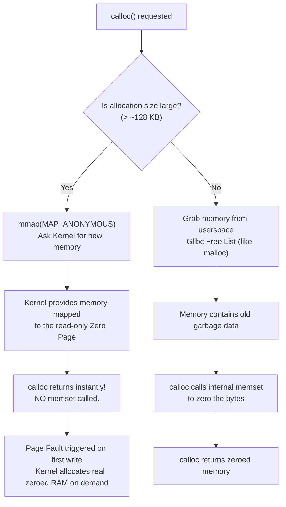
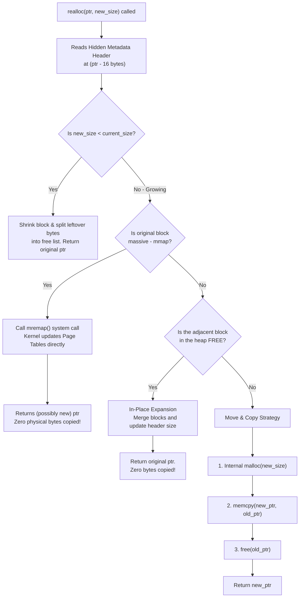
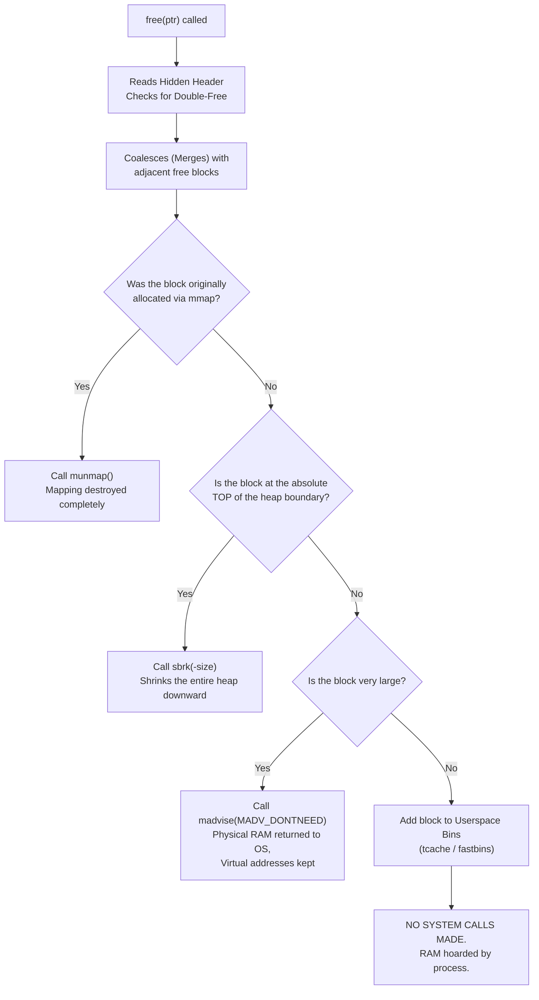
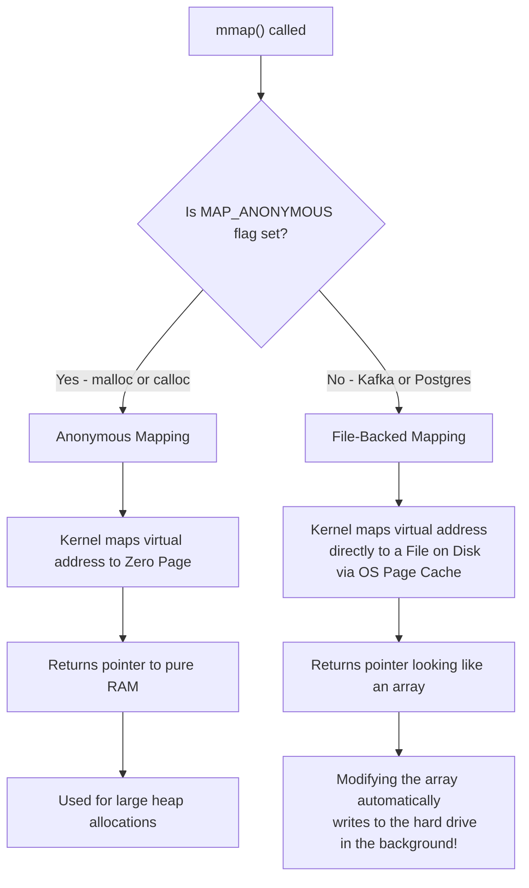
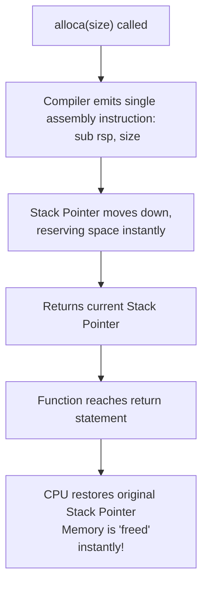

# Memory Allocators: Deep Dive & Interview Grill Guide

This document covers the C memory allocation family (`malloc`, `calloc`, `realloc`, `free`) and the advanced POSIX extensions (`mmap`, `aligned_alloc`, `alloca`). It is structured specifically for systems engineering interviews (AWS, Datadog, Cloudflare) with direct tie-ins to the **TaskBroker** project.

---

## 1. `malloc` (Memory Allocate)

**Signature:** `void* malloc(size_t size);`

*   **Parameters:** 
    *   `size_t size`: The exact number of bytes you want to allocate. (`size_t` is an unsigned integer type returned by `sizeof`).
*   **Returns:** 
    *   `void*`: A generic pointer to the first byte of the allocated memory block.
    *   **On Failure:** Returns `NULL` if the system is completely out of memory.

### Under the Hood
When you call `malloc`, it requests a contiguous block of `size` bytes from the Heap. 
Crucially, `malloc` **does not clean or zero-out the memory**. It simply hands you a pointer to a chunk of RAM. If that chunk of RAM was previously used by another part of your program and freed, it will still contain the old "garbage" data.

If you request a small amount of memory, glibc (the C standard library) will fetch it from an internal "Free List" or "Slab" without asking the Linux Kernel. This makes small `malloc`s extremely fast (executing entirely in userspace).

### TaskBroker Insight
In `broker.c`, when we parse a `PUSH` command, we do:
```c
Job* new_job = (Job*)malloc(sizeof(Job));
```
Because we immediately populate `new_job->id`, `new_job->priority`, and `strncpy(new_job->cmd, ...)`, we don't care that `malloc` returned garbage memory. We overwrite all the garbage instantly.

### The Interview Grill
**Interviewer:** *"In TaskBroker, why did you use `malloc` to create the `Job` struct instead of just declaring a local variable like `Job new_job;` on the stack inside the `client_handler` thread?"*

**Defense:** If I declare `Job new_job;` on the stack, that memory only exists for the exact duration of the `client_handler` function. As soon as the `client_handler` thread exits, its stack is destroyed. However, the `Job` needs to live on! It gets pushed into the global Min-Heap and might be processed by a completely different Worker thread 5 minutes later. `malloc` allocates on the Heap, meaning the memory survives infinitely until explicitly passed to `free()`.

---

## 2. `calloc` (Contiguous Allocate)

**Signature:** `void* calloc(size_t num_elements, size_t element_size);`

*   **Parameters (2 total):**
    *   `size_t num_elements`: The number of elements you want in your array.
    *   `size_t element_size`: The size in bytes of a single element. (The total allocation will be `num_elements * element_size`).
*   **Returns:**
    *   `void*`: A generic pointer to the allocated, **zero-initialized** memory.
    *   **On Failure:** Returns `NULL`.

### Under the Hood
`calloc` allocates memory for an array and **initializes all bytes to zero**. 
Because it has to guarantee zeroes, is it always slower than `malloc`? Does it just call `memset`?

**Yes for small allocations, but NO for large allocations!**

1. **Small Allocations (The `memset` path):** If you ask `calloc` for a small amount of memory, it grabs this from its internal userspace "Free List" (memory your program previously used and freed). Because this memory contains garbage data, `calloc` essentially calls `malloc` and then explicitly zeroes it out using an optimized internal `memset`.
2. **Large Allocations (The OS "Zero Page" magic):** If you ask `calloc` for a massive array (typically > 128 KB), it makes an `mmap(MAP_ANONYMOUS)` system call to ask the Linux Kernel for brand new memory. For security reasons, the kernel *guarantees* that brand new memory is completely pre-zeroed (so you can't read old data from other programs). Because `calloc` knows the kernel just gave it pre-zeroed memory, it **skips the `memset` entirely!**

Even better, the kernel uses **Demand Paging**. It maps your massive allocation to a single, read-only physical page called the "Zero Page". The OS only allocates real physical RAM and zeroes it at the exact microsecond your program tries to write to a specific page.



### The Interview Grill
**Interviewer:** *"If `calloc` is safer because it zeroes memory, why didn't you use it for allocating your `Job` structs?"*

**Defense:** Our `Job` struct is small (264 bytes). Therefore, `calloc` would take the `memset` path. Since our string parser immediately overwrites the `id`, `priority`, and `cmd` fields of the `Job` struct with incoming TCP data, initializing the memory to zero first achieves nothing. Performance is paramount in a broker, so we use `malloc` to avoid the unnecessary `memset`.

---

## 3. `realloc` (Re-Allocate)

**Signature:** `void* realloc(void* ptr, size_t new_size);`

*   **Parameters (2 total):**
    *   `void* ptr`: The pointer to the previously allocated memory block (must have been returned by `malloc`, `calloc`, or a previous `realloc`).
    *   `size_t new_size`: The new total size in bytes you want the block to be.
*   **Returns:**
    *   `void*`: A pointer to the newly resized memory block. This *might* be the exact same pointer you passed in, or it might be a completely new memory address!
    *   **On Failure:** Returns `NULL` (but leaves the original memory block untouched!).

### Under the Hood
To understand `realloc`, you must know a secret about C memory allocators: **every pointer hides metadata right behind it.**
When you call `ptr = malloc(32)`, the allocator usually allocates roughly 48 bytes. It places a hidden header (e.g., 16 bytes) right *before* your pointer (`ptr - 16 bytes`). This header stores the size of your block and flags indicating if adjacent blocks are free.

When you call `realloc(ptr, new_size)`, it reads that hidden header and attempts one of four strategies:

1. **Shrinking:** If `new_size` is smaller than the current size, `realloc` shrinks the hidden header's size field and splits the leftover bytes at the end into a new "Free" chunk (adding it to the free list). It returns the exact same pointer.
2. **In-Place Expansion (Growing Fast):** It checks the hidden header of the block immediately *after* yours. If that next block is marked as "Free" and has enough space, `realloc` merges your block with the free block. It updates your header's size and returns your exact same pointer. (Zero data copying!).
3. **Move and Copy (Growing Slow):** If the memory block immediately after yours is in use, `realloc` cannot expand. It is forced to:
    a) Call internal `malloc(new_size)` to find a larger location.
    b) Call `memcpy()` to copy every byte from the old location to the new location.
    c) Call `free()` on your old pointer.
    d) Return the new pointer.
4. **The `mremap` OS Magic:** If your original array was massive (allocated via `mmap`), glibc uses a special Linux system call called **`mremap`**. `mremap` can resize the mapping. Amazingly, if it needs to move the mapping to find space, the Linux Kernel updates your process's **Page Tables**, pointing the new virtual addresses to the exact same physical RAM chips. It moves gigabytes of memory instantly without copying a single physical byte!



### TaskBroker Insight
In `heap.c`, we use this to grow our Priority Queue:
```c
if (heap->size >= heap->capacity) {
    heap->capacity *= 2;
    heap->array = (Job**)realloc(heap->array, heap->capacity * sizeof(Job*));
}
```

### The Interview Grill
**Interviewer:** *"Take a look at your `realloc` code. What happens if the server completely runs out of RAM right when `realloc` is called?"*

**Defense:** If `realloc` fails due to Out-Of-Memory (OOM), it returns `NULL`. 
However, there is a massive trap here! If `realloc` fails, it **does not free the old memory**. 
Because I wrote `heap->array = realloc(heap->array, ...)`, if it returns `NULL`, I just overwrote my only pointer to `heap->array`. The old array is now permanently orphaned in memory (a catastrophic memory leak). 

*Note: To fix this for production, you must use a temporary pointer:*
```c
Job** temp = realloc(heap->array, new_size);
if (temp == NULL) { /* handle error */ }
else { heap->array = temp; }
```

---

## 4. `free` (De-Allocate)

**Signature:** `void free(void* ptr);`

*   **Parameters (1 total):**
    *   `void* ptr`: The pointer to the memory block you want to deallocate. (Passing `NULL` to `free` is perfectly safe; it simply does nothing).
*   **Returns:** 
    *   `void` (Nothing).

### Under the Hood
What actually happens when you call `free`? Just like `realloc`, `free` shifts your pointer backward to read the **Hidden Metadata Header**. It reads the size of the block and immediately checks a security flag. If the block is *already* marked as free, `free` instantly crashes your program with a "double free or corruption" abort signal.

Once the security check passes, `free` attempts **Coalescing** (Merging). It checks the adjacent memory blocks before and after yours. If they are also free, it merges them all into one giant free block to prevent heap fragmentation.

Finally, `free` must decide what to do with this memory. It takes one of four paths, utilizing different system calls:

1. **Userspace Binning (Zero System Calls):** For 99% of small-to-medium allocations, `free` makes ZERO system calls. It simply adds your block to an internal linked list (a "tcache" or "fastbin") inside userspace. The memory is hoarded so the next `malloc` can serve it instantly. *(If you check `htop`, your server's RAM usage will NOT go down!).*
2. **Heap Trimming (`sbrk`):** If the block being freed happens to touch the absolute top of the main heap (the "program break"), `free` might decide to shrink the entire heap by calling `sbrk(-size)`. This system call physically returns the memory to the OS.
3. **Massive Blocks (`munmap`):** If the hidden header indicates this block was massive and allocated via `mmap`, `free` doesn't bother with userspace bins. It immediately calls the **`munmap(ptr, size)`** system call, which destroys the virtual mapping entirely and returns the RAM to the kernel.
4. **The Middle-Heap Purge (`madvise`):** If a very large chunk of memory is freed, but it's stuck in the *middle* of the heap (meaning `sbrk` can't shrink the top), glibc can call **`madvise(ptr, size, MADV_DONTNEED)`**. This system call tells the Kernel to instantly take back the physical RAM chips, even though the virtual addresses remain reserved in userspace.



### TaskBroker Insight
When an `ACK` is received, we do:
```c
free(in_flight[client_fd]);
in_flight[client_fd] = NULL;
```
Setting the pointer to `NULL` immediately after freeing is defensive programming. It prevents "Use-After-Free" bugs (where a thread accidentally tries to read data from a pointer that has already been deallocated) and "Double-Free" bugs (where a thread accidentally calls `free` twice on the same pointer, which corrupts the glibc heap manager and instantly crashes the program).

---

## Advanced Relatives (POSIX Specifics)

To ace a senior-level systems interview, you must know what lies beneath and beyond `malloc`.

### 5. `mmap` (Memory Map)

**Signature:** `void *mmap(void *addr, size_t length, int prot, int flags, int fd, off_t offset);`

*   **Parameters:**
    *   `void *addr`: Suggested starting address (usually pass `NULL` and let the kernel choose).
    *   `size_t length`: Number of bytes to map (must be a multiple of the OS Page Size, usually 4KB).
    *   `int prot`: Protections (e.g., `PROT_READ | PROT_WRITE`).
    *   `int flags`: Crucial flag determining the *type* of mapping (e.g., `MAP_PRIVATE`, `MAP_SHARED`, `MAP_ANONYMOUS`).
    *   `int fd`: File descriptor (if mapping a file, otherwise -1).
    *   `off_t offset`: Offset inside the file to start mapping from.
*   **Returns:** A pointer to the newly mapped memory area, or `MAP_FAILED` on error.

### Under the Hood
`mmap` is the fundamental system call that bridges virtual memory and physical resources. It operates in two entirely different modes depending on the `flags` parameter:

#### Mode 1: Anonymous Mapping (`MAP_ANONYMOUS`)
When `malloc` or `calloc` need a massive chunk of memory (usually > 128 KB), they bypass their userspace free-lists and call `mmap` with the `MAP_ANONYMOUS` flag. 
*   **What it means:** "Anonymous" means the memory is **not backed by any file**. It is pure, raw RAM. 
*   As discussed in the `calloc` section, the Linux kernel uses Demand Paging to instantly return a pointer mapped to the "Zero Page" without actually assigning physical RAM until the first write occurs.

#### Mode 2: File-Backed Mapping (The Kafka/Database Secret)
If you pass a valid file descriptor (`fd`) to `mmap` (and omit `MAP_ANONYMOUS`), the kernel takes a file from your hard drive and maps it directly into your process's memory space.
*   **The Magic:** You no longer need to call `read()` or `write()`. The file simply looks like a giant array of bytes in RAM. If you change `array[500] = 'X'`, the OS Page Cache automatically intercepts this memory modification and syncs that byte back to the physical hard drive in the background!
*   **Systems Insight:** Modern databases (like PostgreSQL) and Message Queues (like Kafka) use this. It allows them to rely completely on the Kernel's ultra-optimized **OS Page Cache** to handle disk I/O, bypassing userspace buffer copying entirely. This avoids the overhead of traditional `read`/`write` system calls and is a key component of "Zero-Copy" architectures.



### 6. `aligned_alloc` / `posix_memalign`

**Signature:** `void *aligned_alloc(size_t alignment, size_t size);`

*   **Parameters:**
    *   `size_t alignment`: The byte boundary you want to align to (must be a power of 2, e.g., 64, 4096).
    *   `size_t size`: The number of bytes to allocate (must be a multiple of `alignment`).
*   **Returns:** A generic pointer aligned to the requested boundary, or `NULL` on failure.

### Under the Hood
Sometimes, hardware requires memory addresses to be perfectly divisible by a certain number (e.g., 64-byte or 4096-byte boundaries).
*   **Systems Insight:** CPU Caches operate in 64-byte chunks called "Cache Lines." If a C `struct` happens to straddle two different cache lines (e.g., half the struct is at the end of line 1, the other half at the start of line 2), the CPU must do double the work to read it.
*   `aligned_alloc` guarantees the memory address returned is mathematically aligned to a boundary you specify. This is crucial for writing custom Memory Allocators, High-Frequency Trading systems, or game engines.

### 7. `alloca` (Stack Allocation)

**Signature:** `void *alloca(size_t size);`

*   **Parameters:** 
    *   `size_t size`: The number of bytes to allocate.
*   **Returns:** A generic pointer to the allocated space. (It rarely fails in a catchable way; if it fails, the program usually crashes immediately).

### Under the Hood
What happens internally? Absolutely nothing complex! `alloca` is actually **not a real C library function**. It is a compiler intrinsic built directly into `gcc` or `clang`. There is no hidden metadata header, no free list, and no system calls.

When you call `alloca(size)`, the compiler literally just emits a single assembly instruction to subtract `size` from the **Stack Pointer register** (e.g., `sub rsp, 32` on an x86_64 CPU).
*   Because the stack grows downward in memory, simply subtracting from the stack pointer instantly "reserves" space for you.
*   It returns the new value of the stack pointer as your memory address.

When your function is finished, the CPU executes the `ret` (return) assembly instruction, which automatically restores the Stack Pointer to what it was *before* the function was called. This instantly "frees" all `alloca` memory automatically.



### The Interview Grill
**Interviewer:** *"Why not use `alloca` everywhere to avoid memory leaks?"*

**Defense:** The Stack is extremely small (usually capped at 8MB per thread on Linux). Because `alloca` does no safety checks, if you `alloca` a massive array (or pass a negative number), the CPU just blindly subtracts that from the stack pointer. The stack pointer crashes straight through the 8MB stack limit, triggers a Segmentation Fault (stack overflow), and instantly kills the entire server. Furthermore, data allocated with `alloca` cannot be passed back up the call chain (returned to a caller function) because it is destroyed the exact nanosecond the function exits.

---

### 8. The Hidden System Calls (`brk`, `sbrk`, `munmap`, `madvise`)

Beyond `mmap` and `mremap`, the glibc memory allocator relies on a few other critical system calls to manage the heap under the hood.

#### `brk` and `sbrk` (The Heap Boundary)
Before `mmap` became the standard for large allocations, `brk` and `sbrk` were the original Unix system calls for memory allocation. 
*   **What they do:** Every Linux process has a "data segment" representing the main Heap. `sbrk(increment)` simply moves the boundary (the "program break") of the heap upward, extending the data segment and requesting more memory from the OS.
*   **Usage today:** `malloc`, `calloc`, and `realloc` still use `sbrk` when they need to expand the main memory arena for small-to-medium allocations. If the internal free list is empty, they call `sbrk` to physically stretch the heap upwards, carve out a block, and return it.

#### `munmap` (Memory Un-Map)
When you call `free(ptr)` or when `realloc` does a move-and-copy, if the original pointer was a massive block allocated via `mmap`, the allocator doesn't just put it on a free list. It calls `munmap`.
*   **What it does:** It completely destroys the virtual memory mapping, immediately returning both the virtual address space and the physical RAM back to the Linux Kernel.

#### `madvise` (Memory Advise)
This is a senior-level secret. When you call `free()` on a large chunk of memory that was *not* mmapped (it's in the middle of the main heap), the allocator cannot use `sbrk` to shrink the heap because other variables might still be living above it. It also cannot use `munmap`. 
So how does it return physical RAM to the OS to prevent the server from running out of memory? It uses `madvise(ptr, length, MADV_DONTNEED)`.
*   **What it does:** It tells the Linux Kernel: *"Keep my virtual memory addresses valid, but take back the actual physical RAM chips. I don't need the data anymore."* 
*   **The Magic:** The Kernel reclaims the physical RAM for other programs. If your program accidentally tries to read that memory later (a Use-After-Free bug), instead of crashing, the Kernel will instantly provide fresh zeroed-out pages (Demand Paging again!).

---

### 9. Systems Architecture & Debugging

From an interview perspective, writing code that works is only half the battle. You must understand the architectural side-effects of using the Heap, and how to prove your code is safe.

#### Memory Fragmentation
Memory isn't just about total size; it's about layout.
*   **External Fragmentation:** Imagine you have 1GB of total free RAM, but it is broken up into millions of tiny 10-byte holes scattered across the heap due to thousands of random `malloc` and `free` calls. If you try to `malloc` a 1MB array, it fails (Returns `NULL`) because there is no *contiguous* chunk of 1MB available, even though you have 1GB free!
*   **Internal Fragmentation:** You ask `malloc` for 33 bytes. Because memory must be mathematically aligned to CPU cache boundaries, the allocator gives you 48 bytes. You just wasted 15 bytes. Multiplied across a billion objects, this secretly destroys RAM efficiency.

#### Custom Allocators (Memory Pools / Arenas)
In High-Frequency Trading (HFT), modern Database engines, and Video Game Engines (like Unreal Engine), **calling `malloc` during runtime is strictly banned**. 
*   **The Problem:** `malloc` and `free` use locks (mutexes) under the hood to protect their internal free lists. If 100 threads call `malloc` at the exact same time, 99 of them are put to sleep, completely destroying performance. Furthermore, they cause severe fragmentation.
*   **The Solution:** You use an **Arena Allocator**. At startup, the server calls `mmap` once to grab 10GB of raw RAM. You then write your own incredibly simple, lock-free logic to hand out pointers to that pre-allocated block. When a game level (or web request) finishes, you don't call `free` on the individual objects; you just reset your Arena's pointer back to the start of the 10GB block, instantly "freeing" millions of objects in $O(1)$ time.

#### AddressSanitizer (ASan) and Valgrind
If an interviewer asks: *"How do you prove your C code doesn't have memory leaks or Use-After-Free bugs before pushing to production?"*
*   **The Answer:** "I compile the code with `gcc -fsanitize=address`. AddressSanitizer (ASan) instruments the binary, automatically adding 'poisoned redzones' around every `malloc` block. If my pointer accidentally reads 1 byte past the end of the array, or tries to read memory I already passed to `free()`, ASan intercepts it, instantly crashes the program, and prints the exact file and line number of the illegal memory access."

---

### 10. The Ultimate Campus Interview Question: Implement `malloc`

In campus interviews for top-tier systems companies (Apple, Microsoft, NVIDIA, trading firms), a classic "weed-out" question is asking you to implement `malloc` and `free` from scratch. This is famously known as the "K&R Malloc" problem.

They don't expect production-ready `mmap` complexity, but they **do** expect you to design the Hidden Metadata Header and a Linked List traversal algorithm.

#### Step 1: The Metadata Header Struct
The core trick is defining a struct that sits in memory right before the user's data.
```c
struct Block {
    size_t size;        // Size of the memory block
    bool is_free;       // Is this block currently available?
    struct Block *next; // Pointer to the next block in the heap
};

// Global pointer to the start of our heap linked list
struct Block *free_list = NULL; 
```

#### Step 2: The `malloc` Implementation ("First-Fit" Search)
When `malloc(size)` is called, you must iterate through the linked list to find a free block large enough. If none exists, you use the `sbrk()` system call to request more RAM from the OS.

```c
void* my_malloc(size_t size) {
    if (size == 0) return NULL;
    
    struct Block *current = free_list;
    
    // 1. Search the free list for a block that fits (First-Fit algorithm)
    while (current != NULL) {
        if (current->is_free && current->size >= size) {
            current->is_free = false; // Claim the block
            
            // Return a pointer to the memory EXACTLY AFTER the header
            return (void*)(current + 1); 
        }
        current = current->next;
    }
    
    // 2. If no block fits, ask the OS for more memory using sbrk
    size_t total_size = sizeof(struct Block) + size;
    struct Block *new_block = (struct Block*)sbrk(total_size);
    
    if (new_block == (void*)-1) {
        return NULL; // Out of memory
    }
    
    // Initialize the new header
    new_block->size = size;
    new_block->is_free = false;
    new_block->next = free_list;
    
    // Update the global head of the list
    free_list = new_block;
    
    // Return pointer to the memory after the header
    return (void*)(new_block + 1);
}
```

#### Step 3: Implementing `calloc` (The Trick Question)
If they ask you to implement `calloc`, it's a test to see if you realize it's just `malloc` + `memset`.
```c
void* my_calloc(size_t num_elements, size_t element_size) {
    size_t total_size = num_elements * element_size;
    void *ptr = my_malloc(total_size);
    
    if (ptr != NULL) {
        // Zero out the newly allocated memory
        memset(ptr, 0, total_size);
    }
    
    return ptr;
}
```

#### Step 4: Implementing `free`
`free` is incredibly simple if you have the header. You just cast the pointer backward to find the header and mark it as free.
```c
void my_free(void *ptr) {
    if (ptr == NULL) return;
    
    // Cast the pointer backward by the size of the header
    struct Block *header = (struct Block*)ptr - 1;
    
    // Mark it as free so the next malloc can use it
    header->is_free = true;
}
```
*(Note: A true senior-level `free` would also iterate through the list and merge adjacent free blocks together to prevent fragmentation!)*
