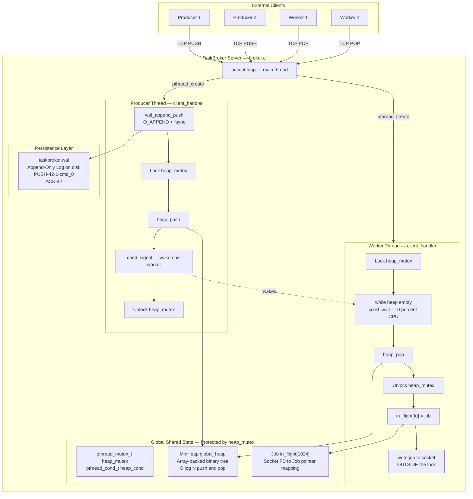
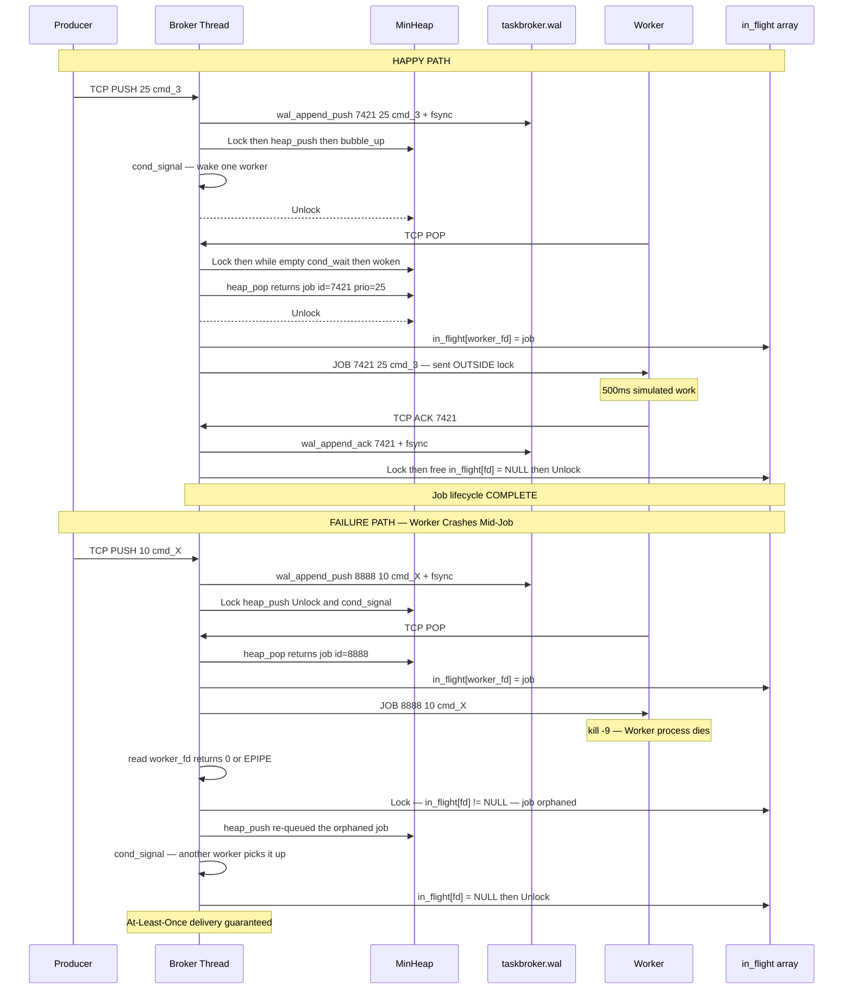
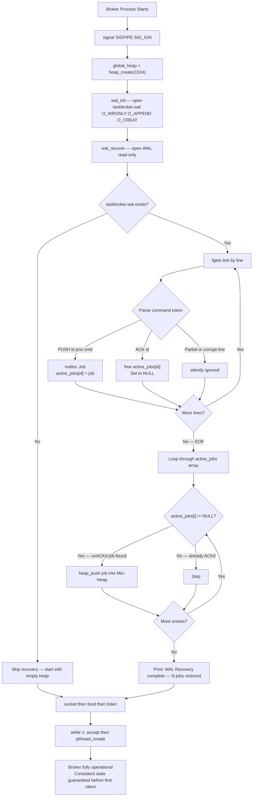

# TaskBroker — 10-Day Study & Defense Guide

Campus interview target: **AWS, Cloudflare, Stripe, Datadog, Backend Engineering Teams**
Project: **TaskBroker** — Fault-Tolerant Distributed Job Queue (Min-Heap, WAL, CondVars)
Daily budget: **4–6 focused hours**

---

## Days 1–4: BUILD PHASE

### Day 1 — Data Structures (Min-Heap & Priority Queue) (6 hours)

| Hour | Task | What You Learn |
|:---:|:---|:---|
| 1 | Project setup: `Makefile`, directory structure, headers (`job.h`, `heap.h`) | Build system, C project layout |
| 2 | Implement dynamic array for the heap (`realloc` logic) | Dynamic memory resizing amortized `O(1)` |
| 3 | Implement `heap_push` + `bubble_up()` | Min-Heap insertions (`O(log N)`) |
| 4 | Implement `heap_pop` + `bubble_down()` | Min-Heap extraction and repair (`O(log N)`) |
| 5 | Write `test_heap.c` — Push 10K random priorities, pop all, assert sorted order | Algorithmic testing methodology |
| 6 | Integrate priority strings (e.g., `PRIORITY:1|CMD:foo`) | Struct mapping and text parsing |

### Day 2 — Networking & Protocol Framing (6 hours)

| Hour | Task | What You Learn |
|:---:|:---|:---|
| 1 | Implement TCP server: `socket`, `bind`, `listen`, `accept`, `SO_REUSEADDR` | TCP socket lifecycle |
| 2 | Implement `SIGPIPE` handling and socket disconnection detection | Defending against kernel process termination |
| 3 | Protocol framing: Buffering partial TCP reads until `\n` delimiter | TCP byte-stream boundaries |
| 4 | Command parsing: Differentiate `PUSH`, `POP`, and `ACK` commands | String parsing (`strtok_r`) |
| 5 | Thread-per-client model: Spawn detached `pthread` for each new connection | Multi-client connection handling |
| 6 | Write echo client to test multi-client connectivity | End-to-end network validation |

### Day 3 — Concurrency & Orchestration (5 hours)

| Hour | Task | What You Learn |
|:---:|:---|:---|
| 1 | Global `pthread_mutex_t` protecting the Min-Heap | Basic mutual exclusion |
| 2 | `pthread_cond_t` integration: Worker `while(empty)` sleep loop | Condition Variables and Spurious Wakeups |
| 3 | Producer signaling: `pthread_cond_signal` on `PUSH` | Thread orchestration (waking sleepers) |
| 4 | Multi-threaded Producer-Consumer stress test (100 producers, 100 workers) | Concurrency validation |
| 5 | ThreadSanitizer run (`-fsanitize=thread`) to mathematically prove zero data races | Proving thread-safety |

### Day 4 — Fault Tolerance & WAL (4 hours)

| Hour | Task | What You Learn |
|:---:|:---|:---|
| 1 | Implement "In-Flight" State: Array mapping Socket FD to `Job*` | State machine tracking |
| 2 | Dead Socket Detection: If `read()==0` or `EPIPE`, pop from In-Flight, push to Heap | At-Least-Once delivery guarantees |
| 3 | WAL implementation: `O_APPEND` incoming jobs, call `fsync` | Disk durability and Page Cache |
| 4 | WAL Tombstones: Append a "DELETE" record when `ACK` is received | Idempotent log compaction |

---

## Days 5–10: DEFENSE PREPARATION PHASE

> [!IMPORTANT]
> You have **6 full days (30+ hours)** to master 40 grill topics. That's more than enough time for deep understanding + whiteboard practice.

---

### Day 5 — Algorithms Deep Dive (Min-Heaps) (5 hours)

**Goal**: Be able to whiteboard the exact math of a Min-Heap and explain why you didn't just use a Linked List.

1. **Why not a Linked List?**
   - Linked lists require `O(N)` scans to find where to insert a high-priority job. A Min-Heap inserts in `O(log N)`. Under heavy load (100,000 jobs), a linked list fails entirely.
2. **Min-Heap Array Math**
   - Must whiteboard: If you are at index `i`, parent is `(i-1)/2`, left child is `2i+1`, right child is `2i+2`.
3. **Bubble-Up (`heap_push`)**
   - Must whiteboard: Insert at the end of the array. `while (arr[i] < arr[parent(i)]) { swap(i, parent(i)); i = parent(i); }`.
4. **Bubble-Down (`heap_pop`)**
   - Must whiteboard: Take the last element, put it at the root (index 0). Compare with left and right children. Swap with the *smallest* child. Repeat until smaller than both children.
5. **Dynamic Resizing (`realloc`)**
   - When the array is full, double its capacity. This makes the insertion cost *amortized* `O(1)` memory-wise.

---

### Day 6 — Concurrency Deep Dive (The Hard Part) (6 hours)

**Goal**: Flawlessly defend Condition Variables and the Producer-Consumer problem.

6. **The Producer-Consumer Problem**
   - Draw the classic buffer problem. Producers add, consumers take. The buffer is shared.
7. **Condition Variables vs Polling**
   - Polling (`while(1) { check_queue(); }`) pins the CPU at 100%. `pthread_cond_wait` tells the OS to put the thread to sleep, yielding the CPU entirely.
8. **Spurious Wakeups (`while` vs `if`)**
   - **The most critical question**: Why use `while(empty) { cond_wait(); }` instead of `if(empty) { cond_wait(); }`?
   - Answer: The OS (Linux scheduler, signals) can wake a thread randomly even if no `cond_signal` was sent. You MUST re-verify the condition (that the queue is not empty) upon waking up.
9. **Lost Wakeups**
   - If a producer calls `cond_signal` *before* the consumer calls `cond_wait`, the signal vanishes. The consumer then goes to sleep and stays asleep forever. This is why the mutex *must* be held when checking the queue state.
10. **The Thundering Herd (`cond_signal` vs `cond_broadcast`)**
    - `cond_broadcast` wakes ALL sleeping workers. If you push 1 job, waking 100 workers causes 99 of them to fight for the mutex, realize the queue is empty again, and go back to sleep. This destroys CPU performance. You use `cond_signal` to wake exactly 1 worker.
11. **Mutex Internals (Futex)**
    - In userspace, a mutex is an atomic Compare-And-Swap (CAS). It only enters the kernel (`futex`) if it is contended. Uncontended mutexes take ~5 nanoseconds.
12. **Priority Inversion**
    - A high-priority thread gets stuck waiting on a mutex held by a low-priority thread. Solved by Priority Inheritance.

---

### Day 7 — Distributed Systems & Fault Tolerance (5 hours)

**Goal**: Explain exactly how your system prevents data loss during worker node crashes.

13. **At-Least-Once Delivery**
    - The broker guarantees a job is processed *at least once*. If a worker dies, it is re-processed. 
14. **In-Flight State Tracking**
    - You must explain how you map a socket FD to a Job pointer. When `read()` returns `0` (clean disconnect) or `EPIPE` (dirty disconnect), you catch the error, retrieve the Job pointer, lock the heap, and push it back in.
15. **The Two Generals Problem (Network Partitions)**
    - What if the worker finishes the job and sends the `ACK`, but the router drops the packet? The broker thinks the worker died, and re-queues the job.
16. **Worker Idempotency**
    - Because of the Two Generals problem, workers might receive the exact same job twice. The *worker* application must be idempotent (e.g., executing a database `UPDATE` that is safe to run twice).
17. **Dead Letter Queues (Theory)**
    - Even if we didn't implement it, explain how you *would*: Add a `retry_count`. If a job crashes the worker 3 times, move it to a DLQ so it doesn't poison the whole cluster.

---

### Day 8 — Storage & Networking (Identical to VeloceStore) (5 hours)

**Goal**: Defend the Write-Ahead Log and TCP Socket lifecycle.

18. **`O_APPEND` Atomicity**
    - Why `O_APPEND` guarantees atomic writes by the kernel, whereas `lseek(SEEK_END)` + `write()` can cause interleaving data corruption between threads.
19. **Page Cache vs Physical Disk**
    - `write()` just copies data to RAM (OS Page Cache). If the power cuts, data is lost.
20. **`fsync()` vs `fdatasync()`**
    - `fsync()` blocks until the physical disk controller acknowledges the write.
21. **TCP `TIME_WAIT` & `SO_REUSEADDR`**
    - Why ports lock for 60 seconds after closing, and how `SO_REUSEADDR` bypasses this for fast restarts.
22. **TCP Stream Framing**
    - `write("PUSH A\nPUSH B\n")` can arrive as a single chunk. You must explain your read-buffer loop searching for the `\n` delimiter.
23. **`SIGPIPE`**
    - Writing to a closed client socket sends a `SIGPIPE` signal which instantly kills the server. You must call `signal(SIGPIPE, SIG_IGN)` to ignore it and check `errno == EPIPE`.
24. **Why not `epoll`?**
    - The thread-per-client model is fine for this scope. To scale to 10,000+ connections, you would move to an event loop (`epoll`) to eliminate OS context-switching overhead.

---

### Day 9 — Mock Interview Practice (5 hours)

#### Hour 1: Elevator Pitch Drill (Repeat 5 Times Out Loud)
> "I built a fault-tolerant, priority-based distributed job queue in pure C. To guarantee at-least-once delivery, I implemented an In-Flight state machine that tracks socket connections and automatically re-queues jobs if a worker node crashes. To optimize routing, I wrote a custom Min-Heap data structure that bubbles high-priority jobs to the front in `O(log N)` time. The system leverages POSIX condition variables to orchestrate sleeping workers with zero idle CPU overhead, and uses a Write-Ahead Log to survive server crashes."

#### Hour 2: Rapid-Fire Q&A
1. **Why a Min-Heap instead of a Linked List?** → `O(log N)` insertions vs `O(N)`.
2. **What is a Spurious Wakeup?** → OS waking a thread without a `cond_signal`. Use a `while` loop.
3. **What is the Thundering Herd?** → `cond_broadcast` waking 100 threads for 1 job. Use `cond_signal`.
4. **How do you guarantee a job isn't lost if a worker loses WiFi?** → In-Flight state tracking mapped to the Socket FD.
5. **Is `write()` durable?** → No, it goes to RAM. You must `fsync`.

#### Hour 3-4: Whiteboard Drill
*   Draw the exact Bubble-Up pseudocode from memory.
*   Draw the exact `cond_wait` Producer-Consumer loop from memory.
*   Draw the exact flow of the `EPIPE` recovery logic.

---

### Day 10 — Final Review & Weak Spots (5 hours)

Read through your code line by line. If the interviewer points to any line and asks "Why did you do this?", you must have a 10-second answer prepared.

**Common Weak Spots to double-check (And how to defend them):**

1.  **The Array Resizing Logic (`realloc`)**
    *   **The Trap**: An interviewer asks, "If the queue grows to 10,000 jobs, won't `realloc` be incredibly slow if it has to copy the entire array every time?"
    *   **The Defense (Way Around)**: Defend the **Amortized `O(1)`** resizing strategy. When the heap hits capacity, you don't increase it by 1; you double it (`capacity = capacity * 2`). This means `realloc` happens logarithmically rarely. Furthermore, explain that `realloc` on Linux will attempt to extend the memory segment *in-place* if there is contiguous space available in the virtual address space, meaning it often doesn't even need to copy the memory at all.
2.  **String Parsing (`strtok` vs `strtok_r`)**
    *   **The Trap**: The interviewer looks at your TCP parsing code and asks, "If 10 threads receive jobs at the exact same time, will your string parser corrupt the data?"
    *   **The Defense (Way Around)**: You must confidently explain that the standard C `strtok()` function is fundamentally **not thread-safe** because it uses a hidden, global static variable in glibc to remember where it left off in the string. If Thread A calls it, and Thread B preempts and calls it, Thread A's state is permanently destroyed. You defend that you strictly used `strtok_r()` (the reentrant version), which requires you to pass a `char **saveptr`. This tracks the parsing state locally on the thread's own stack, making it 100% thread-safe.
3.  **The Mutex Scope (I/O Under a Lock)**
    *   **The Trap**: The interviewer looks at your worker loop and asks, "Why didn't you just `write()` the job string to the TCP socket while you still had the global heap mutex locked? It seems safer."
    *   **The Defense (Way Around)**: State this as an absolute rule: **Never perform network or disk I/O while holding a global lock.** Network `write()` calls can block if the client's TCP receive window is full, or it can take milliseconds to resolve. If you hold the global heap mutex while writing to the network, your entire broker freezes and the other 9,999 clients will time out. The correct way around: Lock the mutex -> Pop the job -> Move it to the In-Flight state -> **Unlock the mutex** -> Then `write()` to the socket.

---

---

# Part 2: The Builder's Deep Dive — Everything You Actually Wrote

> This section is the complete technical reference for the TaskBroker codebase as built. Read this after Part 1. Use it to defend every line of code during interviews.

---

## Section A: Architecture Diagram & System Overview

### Diagram 1 — System Architecture



---

### Diagram 2 — Job Lifecycle: Happy Path vs Failure Path



---

### Diagram 3 — Crash Recovery: WAL Replay on Boot



---

## Section B: File-by-File Code Walkthrough

### `src/job.h` — The Core Data Unit

```c
typedef struct {
    int id;               // Unique Job ID (generated by broker on PUSH)
    int priority;         // Lower number = higher priority (Min-Heap invariant)
    char cmd[256];        // The payload string from the producer
} Job;
```

**Why a fixed-size `char cmd[256]` instead of `char*`?**
If we stored `char*`, we would need to `malloc` the string separately and `free` it across multiple threads and state transitions (PUSH, POP, ACK, re-queue). This creates use-after-free and double-free risks. A fixed-size array embeds the string directly inside the struct: one `malloc(sizeof(Job))` allocates everything, one `free(job_ptr)` deallocates everything — cleanly from any thread.

---

### `src/heap.c` — The Priority Engine

**Why `Job**` (pointer array) not `Job[]` (struct array)?**
Swapping items during `bubble_up`/`bubble_down` would copy `sizeof(Job)` = 264 bytes per swap if we stored structs. Storing pointers means each swap exchanges exactly 8 bytes. This is 33x cheaper.

**Heap Index Math (must whiteboard):**
- Parent of index `i`: `(i - 1) / 2`
- Left child: `2i + 1`
- Right child: `2i + 2`
- Root at index `0` always holds the minimum priority element.

**`heap_push` logic:**
```
1. Double capacity if heap->size >= heap->capacity (amortized O(1))
2. Place job at heap->array[heap->size]   (end of array)
3. bubble_up(heap, heap->size)            (restore Min-Heap upward)
4. heap->size++
```

**`heap_pop` logic:**
```
1. Save root = heap->array[0]             (minimum priority job)
2. Move last element to root              (array[0] = array[size-1])
3. heap->size--
4. bubble_down(heap, 0)                   (restore Min-Heap downward)
5. return root
```

**Why move last to root (not second element)?**
In a heap, only the root and last leaf can be removed cleanly. Placing the last element at root and doing O(log N) `bubble_down` is the optimal repair. Shifting all others would be O(N).

---

### `src/wal.c` — Durability Layer

**`wal_init()` flags:**
- `O_APPEND` — atomic kernel-level seek+write, thread-safe for concurrent producers.
- `O_WRONLY` — write-only during normal operation.
- `O_CREAT` — creates file on first run.

**Write-then-Fsync Pattern:**
```
write() → copies to OS Page Cache (RAM only, lost on power cut)
fsync() → blocks until physical disk controller confirms storage
```
WAL write happens BEFORE acquiring the heap mutex, so slow disk I/O never blocks other threads.

**`wal_recover()` algorithm:**
```
1. Open WAL read-only
2. For each line:
     PUSH|id|prio|cmd  → malloc(Job), store at active_jobs[id]
     ACK|id            → free(active_jobs[id]), set NULL
3. After EOF: push all active_jobs[i] != NULL into Min-Heap
4. Called BEFORE listen() — broker is consistent before first client
```

---

### `src/broker.c` — The Orchestrator

**Startup Sequence (ordering is mandatory):**
```
signal(SIGPIPE, SIG_IGN)         ← 1: Prevent single dead socket from killing broker
global_heap = heap_create(1024)  ← 2: Allocate heap
wal_init("taskbroker.wal")       ← 3: Open WAL for appending
wal_recover(global_heap)         ← 4: Replay WAL before any client can connect
socket()→bind()→listen()         ← 5: Open network
while(1) { accept()→pthread_create() }  ← 6: Serve clients
```

**Why `malloc` the client_fd before passing to thread:**
Stack variable `client_fd` is overwritten by the next `accept()` loop iteration before the new thread reads it. Heap-allocating a unique `int` per connection gives each thread stable, private memory. Thread calls `free(arg)` immediately upon entry.

**TCP Stream Framing:**
TCP delivers bytes, not messages. `"PUSH|1|cmd\n"` may arrive as `"PUSH|1|c"` then `"md\n"`. We accumulate bytes in a buffer, find `\n` with `strchr`, process one complete message, then `memmove` remaining bytes to buffer start. Repeat until no `\n` found.

**The Condition Variable `while` loop:**
```c
while (global_heap->size == 0) {
    pthread_cond_wait(&heap_cond, &heap_mutex);
}
```
`cond_wait` can return spuriously (OS wakes thread without `cond_signal`). `while` forces re-verification. `if` would call `heap_pop` on an empty heap → NULL dereference → crash.

---

## Section C: End-to-End Lifecycle of a Single Job

### Happy Path
```
STEP 1 [Producer connects]:
  producer: connect(127.0.0.1:8080)
  broker: accept() → malloc(int*) → pthread_create(client_handler)

STEP 2 [PUSH handler]:
  producer: send("PUSH|25|cmd_3\n")
  broker thread:
    strtok_r → cmd="PUSH", prio="25", payload="cmd_3"
    malloc(Job) → {id=7421, priority=25, cmd="cmd_3"}
    wal_append_push(7421, 25, "cmd_3") + fsync()  ← durability
    [Lock] heap_push(job) → cond_signal() [Unlock]

STEP 3 [POP handler - worker wakes]:
  worker: send("POP\n")
  broker thread:
    [Lock] while(heap empty) cond_wait()  ← woken by cond_signal
    job = heap_pop()   ← {id=7421, priority=25}
    [Unlock]
    in_flight[worker_fd] = job  ← track ownership
    write(worker_fd, "JOB|7421|25|cmd_3\n")  ← OUTSIDE lock

STEP 4 [ACK handler]:
  worker: usleep(500ms) → send("ACK|7421\n")
  broker thread:
    wal_append_ack(7421) + fsync()  ← tombstone written
    [Lock] free(in_flight[worker_fd]); in_flight[worker_fd]=NULL [Unlock]
    ← Job lifecycle COMPLETE
```

### Failure Path (Worker Crashes Mid-Job)
```
  kill -9 <worker_pid>
  OS sends TCP RST to broker
  broker: read(worker_fd) returns 0 or -1
  broker thread (exits read loop):
    [Lock]
    in_flight[worker_fd] != NULL  ← job detected as orphaned
    heap_push(global_heap, in_flight[worker_fd])  ← RE-QUEUED
    cond_signal()  ← another worker will pick it up
    in_flight[worker_fd] = NULL
    [Unlock]
    close(worker_fd)
```

### Crash Recovery (Broker Power Loss)
```
  WAL on disk after STEP 2 (broker crashes before STEP 4):
    PUSH|7421|25|cmd_3

  Broker restarts:
    wal_recover():
      Read "PUSH|7421|25|cmd_3" → active_jobs[7421] = malloc'd Job
      No matching "ACK|7421" found
      heap_push(heap, active_jobs[7421])
      "WAL Recovery: 1 jobs restored"
    listen()  ← now safe to accept connections
    → Workers reconnect; job 7421 re-processed
```

---

## Section D: Build Phases — Git Branch History

| Branch | Commits | What Was Built |
|:---|:---:|:---|
| `feature/data-structures` | 1–3 | `job.h`, `heap.h`, `heap.c`, `test_heap.c` |
| `feature/networking` | 4–7 | `broker.c` (TCP + threads), `producer.c`, `worker.c` |
| `feature/concurrency` | 8–10 | Mutex, Condition Variables, In-Flight array |
| `feature/fault-tolerance` | 11–13 | `wal.h`, `wal.c`, crash recovery in `main()` |

Each branch is a working, testable milestone. `git log --oneline` shows 13 clean commits evolving from a simple data structure to a fault-tolerant distributed system — engineering discipline visible to any reviewer.

---

## Section E: The STAR Method — Your Interview Narrative

**Situation:**
"At IIITB, I wanted to build a systems project demonstrating concurrency, networking, and distributed systems — the exact domains targeted by AWS, Cloudflare, and Datadog. I needed something non-trivial that I could defend deeply at the code level."

**Task:**
"I designed and built TaskBroker — a fault-tolerant, priority-based distributed job queue in pure C, no external libraries. Three hard problems: O(log N) priority ordering, managing concurrent workers without busy-waiting, and zero job loss even if both the broker and a worker crash simultaneously."

**Action:**
"Built in four phases. Phase 1: dynamic array-backed Min-Heap with amortized O(1) resizing, verified with 10,000-job randomized unit tests. Phase 2: TCP server with thread-per-client model, robust byte-stream framing with a memmove buffer, and thread-safe string parsing using strtok_r. Phase 3: POSIX mutex for heap protection and POSIX condition variables for zero-CPU worker sleep, waking exactly one thread per job with cond_signal. Phase 4: append-only Write-Ahead Log with O_APPEND atomic writes and fsync durability, combined with an In-Flight state machine indexed by socket FDs for dead connection detection and automatic job re-queuing. Crash recovery replays the WAL before accepting any connections."

**Result:**
"Complete, production-architecture-inspired system with correct priority ordering, zero idle CPU, and at-least-once delivery. I can explain every single line under grilling. The project demonstrates simultaneous reasoning about Mutexes, Condition Variables, Distributed Systems failure modes, and Linux kernel semantics."

---

## Section F: Comprehensive Grill Topics & Defenses

### Category 1: Data Structure Grilling

**Q: Why Min-Heap instead of sorted linked list?**
Sorted linked list needs O(N) scan per insertion. At 100,000 jobs: 100,000 comparisons per insert. Min-Heap: O(log N) both push and pop. At 100,000 jobs: ~17 comparisons. The interviewer tests: "Do you know when NOT to use a linked list?"

**Q: Whiteboard the heap index math.**
Parent of `i`: `(i-1)/2`. Left child: `2i+1`. Right child: `2i+2`. Root at `0` is always minimum.

**Q: Won't realloc be slow copying the entire array when it grows?**
Amortized O(1). We double capacity on overflow — realloc happens only log₂(N) times. Linux realloc often extends the virtual memory segment in-place (zero copy). Even if it copies, total work across N inserts is 2N element moves, amortized O(1) per insert.

**Q: Can heap_pop return NULL? What happens?**
Yes, on empty heap. Our POP handler uses `while(size==0) cond_wait()` — guaranteed non-empty before pop. Defensive `if(job)` check also present. Without the while loop, NULL dereference on `job->id` crashes the broker.

---

### Category 2: Concurrency Grilling

**Q: Two workers send POP simultaneously. Do they get the same job?**
No. Both reach `pthread_mutex_lock`. The futex guarantees only one acquires the lock; the other blocks. They cannot pop the same job. Without mutex: two threads with same `Job*` pointer → double-free crash.

**Q: Why while(empty) not if(empty) with cond_wait?**
`pthread_cond_wait` returns spuriously — OS wakes threads due to signals/scheduler events with no cond_signal. `if` calls `heap_pop` on empty heap → NULL → crash. `while` re-verifies actual heap state on every wakeup.

**Q: Why cond_signal inside the lock, not after release?**
Signals after unlock can race: Producer unlocks, Worker re-acquires, checks heap, goes to sleep, Producer then signals a sleeping thread — wasted signal. More critically prevents lost wakeups: if Producer signals before Consumer enters cond_wait, the signal vanishes. Holding mutex ensures signal either wakes Consumer or Consumer sees non-empty heap before sleeping.

**Q: Thundering Herd — did you cause it?**
No. `cond_broadcast` wakes ALL sleeping workers. 1 job + 100 workers = 99 futile mutex acquisitions. I used `cond_signal` which wakes exactly one worker per one job.

**Q: Priority Inversion?**
Theoretically possible: high-priority worker thread blocked on mutex held by low-priority producer thread. Production fix: POSIX Priority Inheritance (`PTHREAD_MUTEX_PROTECT_NP`). Defensible known limitation for student project.

**Q: strtok vs strtok_r — why does it matter?**
`strtok()` uses a hidden global static variable in glibc. If Thread A calls it, Thread B preempts and calls it — Thread A's saved position is permanently overwritten, both parses are corrupted. `strtok_r()` requires explicit `char **saveptr` on each thread's own stack — 100% reentrant, thread-safe.

---

### Category 3: Storage & Networking Grilling

**Q: Why O_APPEND is thread-safe but lseek+write is not?**
`O_APPEND` makes write() an atomic kernel operation — seek-to-end and write are one uninterruptible system call. With `lseek+write`: Thread A seeks to offset 100, Thread B seeks to 100, Thread B writes (file now at 120), Thread A writes at 100 — overwrites Thread B's data. `O_APPEND` is the standard correct solution for concurrent log appending.

**Q: fsync is slow (1-10ms). Won't every PUSH be slow?**
Correct trade-off: durability over throughput. Production mitigation: Group Commit — accumulate 10ms of writes, fsync once, amortize disk cost across many operations. WAL write also happens before heap mutex lock, so disk I/O never blocks heap operations for other threads.

**Q: Why SO_REUSEADDR?**
TCP connections enter TIME_WAIT for ~60 seconds after close. Fast broker restart hits `EADDRINUSE` from bind(). `SO_REUSEADDR` allows rebinding a port in TIME_WAIT when no socket is actively using it. Essential for fast restarts during operations and incident recovery.

**Q: ACK packet dropped — is the job lost?**
No — At-Least-Once delivery. Broker detects connection timeout via TCP keepalive or RST, reads 0 bytes, finds job in `in_flight[fd]`, re-queues it. Same job processed again. Workers must be idempotent: `UPDATE users SET processed=true WHERE id=X` is safe twice; blind `INSERT INTO log(...)` is not.

**Q: Why not epoll?**
Thread-per-client gives clean, linear logic — each connection has its own stack, buffer, and blocking cond_wait. With epoll, one event loop manages all connections but blocking operations are forbidden, forcing a complex state machine per connection. At 1,024 connections, thread-per-client is clean, correct, fast. Upgrade path to epoll + non-blocking I/O is clear and I can describe it fully.

---

### Category 4: WAL & Recovery Grilling

**Q: WAL grows forever. Won't startup take minutes after a week?**
Known limitation. Production solution: periodic Snapshotting — background thread serializes current heap to `snapshot.bin`, atomically replaces old checkpoint, truncates WAL. On restart: load snapshot, replay only WAL entries after checkpoint timestamp. Exactly how PostgreSQL (WAL + base backups) and Kafka (log segments + offsets) work.

**Q: What if WAL is partially written due to crash mid-fsync?**
Partial line not picked up by fgets → strtok_r fails to parse it → silently ignored. That one job at crash boundary may be lost. Production fix: CRC32 checksum per record (`PUSH|742|1|cmd|CRC:0xABCD\n`). Recovery validates checksum, discards corrupted entries → bit-perfect recovery.

**Q: Is `active_jobs[10000]` in wal_recover() a good data structure?**
Deliberate simplicity: direct-address table, O(1) insert and O(1) lookup by Job ID. Fixed 10,000-job upper bound. For production: hash table (open addressing, load factor 0.7) or standard hash map. The replay concept — build map, subtract ACKs, push remainder to heap — is identical at any scale.

---

## Section G: Weak Points — Know Your Limits and Defend Them

### Weakness 1: Non-Atomic In-Flight Assignment
**The issue:** `in_flight[client_fd] = job` happens after `pthread_mutex_unlock`. Theoretically, thread death between unlock and assignment leaves `in_flight[fd]` = NULL and loses the job.
**Reality:** Same thread — no other thread touches this fd's slot. But strictly, assignment belongs inside the lock.
**Defense:** "I acknowledge this. The correct fix: move `in_flight[client_fd] = job` before `pthread_mutex_unlock`. My choice illustrated keeping I/O outside the lock, but production code would be stricter."

### Weakness 2: Non-Unique Random Job IDs
**The issue:** `rand() % 10000` — not thread-safe (global state in glibc), collisions after 10,000 jobs.
**Defense:** "Production fix: `static atomic_int next_id = 0; int id = atomic_fetch_add(&next_id, 1);` — lock-free, monotonically increasing, guaranteed unique, thread-safe."

### Weakness 3: WAL Never Compacted
*(Defend with Snapshot + Incremental Replay — see Section F.)*

### Weakness 4: Fixed `in_flight[1024]` Array
**The issue:** `ulimit -n > 1024` → `client_fd = 1025` → out-of-bounds write.
**Defense:** "Production fix: dynamically sized hash map keyed by fd, or array sized to `RLIMIT_NOFILE`. Add `assert(client_fd < 1024)` as a compile-time guard."

### Weakness 5: No Graceful Shutdown
**The issue:** `Ctrl+C` kills process instantly — in-flight jobs not drained, sockets not closed.
**Defense:** "Production fix: `SIGTERM` handler sets `volatile sig_atomic_t shutdown_requested = 1`, closes listening socket, joins all client_handler threads, closes WAL fd. WAL guarantees recoverability even without graceful shutdown."

### Weakness 6: Blocking fsync Per WAL Write
*(Defend with Group Commit / background fsync thread — see Section F.)*

---

## Section H: Quick-Reference Cheat Sheet for Interview Day

| Concept | Your Implementation | One-Line Defense |
|:---|:---|:---|
| Priority Queue | Min-Heap in `heap.c` | O(log N) push/pop vs O(N) linked list insert |
| Heap Math | Parent=(i-1)/2, children=2i+1,2i+2 | Standard binary tree in flat array |
| Dynamic Resize | realloc, capacity x2 | Amortized O(1); Linux often extends in-place |
| Thread Model | pthread_create per client | Simple, correct, defensible for <1024 connections |
| Zero-CPU Idle | pthread_cond_wait | OS-level sleep; 0% CPU until cond_signal |
| Spurious Wakeup | while(empty) not if(empty) | Re-verify condition on every OS wakeup |
| Thundering Herd | cond_signal not cond_broadcast | 1 job wakes exactly 1 worker |
| Thread-Safe Parse | strtok_r not strtok | saveptr on stack, not glibc global state |
| I/O Under Lock | Never — WAL write before lock | Disk/network blocks for ms; hold mutex briefly |
| Fault Tolerance | In-Flight array + WAL | At-Least-Once via dead socket detection |
| Atomic Log Append | O_APPEND flag | Kernel combines seek+write atomically |
| Disk Durability | fsync() after every write | Physical disk confirmation, not just Page Cache |
| Crash Recovery | wal_recover() before listen() | Replay unACKd PUSHes before accepting clients |
| Scaling Limit | 1024 FDs, no epoll | Known; upgrade path: epoll + non-blocking I/O |
| WAL Growth | No compaction | Known; production fix: Snapshot + incremental replay |


## Code Explanation

Here is a detailed line-by-line explanation of every code file in the project.

### `src/job.h`
```c
1: #ifndef JOB_H
2: #define JOB_H
```
Lines 1-2: Include guards to prevent multiple inclusions of this header file during compilation.

```c
4: #define MAX_CMD_LEN 256
```
Line 4: Defines a constant `MAX_CMD_LEN` with a value of 256, representing the maximum length of the command string payload.

```c
6: typedef struct {
7:     int id;
8:     int priority; // Lower number = higher priority (Min-Heap)
9:     char cmd[MAX_CMD_LEN];
10: } Job;
```
Lines 6-10: Defines a struct named `Job`. It contains an integer `id` (a unique identifier for the job), an integer `priority` (lower values mean higher priority since a Min-Heap is used), and a character array `cmd` to store the command payload up to `MAX_CMD_LEN` characters.

```c
12: #endif // JOB_H
```
Line 12: Ends the include guard `JOB_H`.

### `src/heap.h`
```c
1: #ifndef HEAP_H
2: #define HEAP_H
```
Lines 1-2: Header guards to prevent double inclusion.
```c
4: #include "job.h"
```
Line 4: Includes `job.h` which defines the `Job` struct used in the heap.
```c
6: typedef struct {
7:     Job** array;
8:     int size;
9:     int capacity;
10: } MinHeap;
```
Lines 6-10: Defines the `MinHeap` struct. `array` is a dynamic array of pointers to `Job`. `size` tracks the current number of elements, and `capacity` is the maximum number of elements the array can hold before resizing.
```c
12: MinHeap* heap_create(int initial_capacity);
13: void heap_free(MinHeap* heap);
14: void heap_push(MinHeap* heap, Job* job);
15: Job* heap_pop(MinHeap* heap);
```
Lines 12-15: Function prototypes for managing the heap. `heap_create` initializes it, `heap_free` destroys it, `heap_push` adds a job, and `heap_pop` removes and returns the job with the lowest priority value.
```c
17: #endif // HEAP_H
```
Line 17: Ends the header guard.

### `src/heap.c`
```c
1: #include <stdlib.h>
2: #include "heap.h"
```
Lines 1-2: Includes standard library for memory allocation and `heap.h` for the heap structures.
```c
4: MinHeap* heap_create(int initial_capacity) {
5:     MinHeap* heap = (MinHeap*)malloc(sizeof(MinHeap));
6:     if (!heap) return NULL;
```
Lines 4-6: Allocates memory for a new `MinHeap` structure. Returns NULL if allocation fails.
```c
8:     heap->capacity = initial_capacity > 0 ? initial_capacity : 16;
9:     heap->size = 0;
10:     heap->array = (Job**)malloc(heap->capacity * sizeof(Job*));
11:     if (!heap->array) {
12:         free(heap);
13:         return NULL;
14:     }
15:     
16:     return heap;
17: }
```
Lines 8-17: Initializes the capacity (defaulting to 16 if a non-positive value is provided). Sets size to 0 and allocates the inner array of `Job` pointers. Cleans up and returns NULL if the array allocation fails.
```c
19: void heap_free(MinHeap* heap) {
20:     if (heap) {
21:         if (heap->array) {
22:             free(heap->array);
23:         }
24:         free(heap);
25:     }
26: }
```
Lines 19-26: Safely frees the memory allocated for the heap array and the heap structure itself.
```c
28: static void swap(Job** a, Job** b) {
29:     Job* temp = *a;
30:     *a = *b;
31:     *b = temp;
32: }
```
Lines 28-32: A static helper function to swap two `Job` pointers in the heap array.
```c
34: static void bubble_up(MinHeap* heap, int index) {
35:     while (index > 0) {
36:         int parent = (index - 1) / 2;
37:         if (heap->array[index]->priority < heap->array[parent]->priority) {
38:             swap(&heap->array[index], &heap->array[parent]);
39:             index = parent;
40:         } else {
41:             break;
42:         }
43:     }
44: }
```
Lines 34-44: Restores the min-heap property by comparing a node with its parent. If the child has a lower priority value (higher priority), they are swapped. This continues up the tree until the property is satisfied.
```c
46: static void bubble_down(MinHeap* heap, int index) {
47:     while (1) {
48:         int left = 2 * index + 1;
49:         int right = 2 * index + 2;
50:         int smallest = index;
51: 
52:         if (left < heap->size && heap->array[left]->priority < heap->array[smallest]->priority) {
53:             smallest = left;
54:         }
55:         if (right < heap->size && heap->array[right]->priority < heap->array[smallest]->priority) {
56:             smallest = right;
57:         }
58: 
59:         if (smallest != index) {
60:             swap(&heap->array[index], &heap->array[smallest]);
61:             index = smallest;
62:         } else {
63:             break;
64:         }
65:     }
66: }
```
Lines 46-66: Restores the min-heap property by shifting a node down the tree. It compares a node with its left and right children and swaps it with the smallest one. This continues until the node is smaller than both children or it becomes a leaf.
```c
68: void heap_push(MinHeap* heap, Job* job) {
69:     if (!heap || !job) return;
70: 
71:     if (heap->size >= heap->capacity) {
72:         heap->capacity *= 2;
73:         heap->array = (Job**)realloc(heap->array, heap->capacity * sizeof(Job*));
74:     }
75: 
76:     heap->array[heap->size] = job;
77:     bubble_up(heap, heap->size);
78:     heap->size++;
79: }
```
Lines 68-79: Adds a new job to the heap. If the array is full, it doubles the capacity using `realloc`. The new job is placed at the end of the array, and `bubble_up` is called to position it correctly.
```c
81: Job* heap_pop(MinHeap* heap) {
82:     if (!heap || heap->size == 0) return NULL;
83: 
84:     Job* root = heap->array[0];
85:     heap->array[0] = heap->array[heap->size - 1];
86:     heap->size--;
87:     
88:     if (heap->size > 0) {
89:         bubble_down(heap, 0);
90:     }
91: 
92:     return root;
93: }
```
Lines 81-93: Removes and returns the job at the root of the min-heap (the one with the lowest priority value). The last element is moved to the root, the size is decremented, and `bubble_down` is used to restore the heap property.

### `src/wal.h`
```c
1: #ifndef WAL_H
2: #define WAL_H
3: 
4: #include "heap.h"
```
Lines 1-4: Include guards and includes the `heap.h` for the MinHeap structure.
```c
6: int wal_init(const char* filepath);
7: void wal_append_push(int id, int priority, const char* cmd);
8: void wal_append_ack(int id);
9: void wal_recover(MinHeap* heap);
```
Lines 6-9: Function prototypes for the Write-Ahead Log (WAL). `wal_init` opens the file, `wal_append_push` logs a new job, `wal_append_ack` logs a completed job, and `wal_recover` reconstructs the heap from the log.
```c
11: #endif // WAL_H
```
Line 11: End of include guard.

### `src/wal.c`
```c
1: #include <stdio.h>
2: #include <stdlib.h>
3: #include <string.h>
4: #include <unistd.h>
5: #include <fcntl.h>
6: #include "wal.h"
```
Lines 1-6: Standard includes for I/O, string manipulation, file control (`fcntl.h`), and the `wal.h` header.
```c
8: static int wal_fd = -1;
9: static const char* wal_filepath = NULL;
```
Lines 8-9: Static variables for the WAL file descriptor and filepath, keeping them private to this file.
```c
11: int wal_init(const char* filepath) {
12:     wal_filepath = strdup(filepath);
13:     wal_fd = open(filepath, O_WRONLY | O_APPEND | O_CREAT, 0644);
14:     if (wal_fd < 0) {
15:         perror("Failed to open WAL");
16:         return -1;
17:     }
18:     return 0;
19: }
```
Lines 11-19: Initializes the WAL by duplicating the filepath and opening it in write-only, append mode. If it doesn't exist, it is created (`O_CREAT`) with `0644` permissions.
```c
21: void wal_append_push(int id, int priority, const char* cmd) {
22:     if (wal_fd < 0) return;
23:     char buffer[512];
24:     int len = snprintf(buffer, sizeof(buffer), "PUSH|%d|%d|%s
", id, priority, cmd);
25:     if (write(wal_fd, buffer, len) > 0) {
26:         fsync(wal_fd); // Ensure durability
27:     }
28: }
```
Lines 21-28: Formats a "PUSH" log entry and writes it to the WAL. `fsync` is used to flush the data directly to the disk, ensuring durability (the data survives a crash).
```c
30: void wal_append_ack(int id) {
31:     if (wal_fd < 0) return;
32:     char buffer[256];
33:     int len = snprintf(buffer, sizeof(buffer), "ACK|%d
", id);
34:     if (write(wal_fd, buffer, len) > 0) {
35:         fsync(wal_fd);
36:     }
37: }
```
Lines 30-37: Formats an "ACK" log entry (meaning a job was completed) and writes it to the WAL, syncing it to disk.
```c
39: void wal_recover(MinHeap* heap) {
40:     if (!wal_filepath) return;
41:     FILE* file = fopen(wal_filepath, "r");
42:     if (!file) return;
43: 
44:     printf("Recovering from WAL...
");
```
Lines 39-44: Opens the WAL file in read mode to reconstruct the state.
```c
46:     // Simple fixed-size hash map for active jobs based on ID
47:     Job* active_jobs[10000] = {NULL};
48:     int max_id = 0;
```
Lines 46-48: Creates a temporary array to track jobs by their ID (assuming IDs are under 10000).
```c
50:     char line[1024];
51:     while (fgets(line, sizeof(line), file)) {
52:         char* saveptr;
53:         char* cmd = strtok_r(line, "|", &saveptr);
```
Lines 50-53: Reads the file line by line. `strtok_r` safely splits each line using the pipe `|` delimiter.
```c
55:         if (cmd && strcmp(cmd, "PUSH") == 0) {
56:             char* id_str = strtok_r(NULL, "|", &saveptr);
57:             char* prio_str = strtok_r(NULL, "|", &saveptr);
58:             char* payload_str = strtok_r(NULL, "
", &saveptr);
59:             
60:             if (id_str && prio_str && payload_str) {
61:                 int id = atoi(id_str);
62:                 Job* job = (Job*)malloc(sizeof(Job));
63:                 job->id = id;
64:                 job->priority = atoi(prio_str);
65:                 strncpy(job->cmd, payload_str, MAX_CMD_LEN - 1);
66:                 job->cmd[MAX_CMD_LEN - 1] = '';
67:                 
68:                 if (id < 10000) {
69:                     active_jobs[id] = job;
70:                     if (id > max_id) max_id = id;
71:                 }
72:             }
73:         }
```
Lines 55-73: If the log is a "PUSH", it parses the ID, priority, and payload, allocates a new `Job`, and stores it in the `active_jobs` array.
```c
73:         else if (cmd && strcmp(cmd, "ACK") == 0) {
74:             char* id_str = strtok_r(NULL, "
", &saveptr);
75:             if (id_str) {
76:                 int id = atoi(id_str);
77:                 if (id < 10000 && active_jobs[id] != NULL) {
78:                     free(active_jobs[id]);
79:                     active_jobs[id] = NULL;
80:                 }
81:             }
82:         }
83:     }
```
Lines 73-83: If the log is an "ACK", the corresponding job was successfully processed, so it is freed and removed from the `active_jobs` array.
```c
84:     
85:     fclose(file);
86: 
87:     int recovered_count = 0;
88:     for (int i = 0; i <= max_id; i++) {
89:         if (active_jobs[i] != NULL) {
90:             heap_push(heap, active_jobs[i]);
91:             recovered_count++;
92:         }
93:     }
94:     
95:     printf("WAL Recovery complete. %d jobs restored to Min-Heap.
", recovered_count);
96: }
```
Lines 85-96: Closes the file, pushes any remaining active jobs (which were never ACKed) into the heap, and prints a summary.

### `src/worker.c`
```c
1: #include <stdio.h>
2: #include <stdlib.h>
3: #include <string.h>
4: #include <unistd.h>
5: #include <arpa/inet.h>
6: 
7: #define PORT 8080
```
Lines 1-7: Standard includes and port definition, same as the producer.
```c
9: int main(int argc, char const *argv[]) {
10:     int sock = 0;
11:     struct sockaddr_in serv_addr;
12:     
13:     if ((sock = socket(AF_INET, SOCK_STREAM, 0)) < 0) {
...
29:     }
```
Lines 9-29: Setup for the TCP socket and connection to the broker at `127.0.0.1:8080`.
```c
31:     char buffer[1024] = {0};
32:     
33:     int num_jobs = 10;
34:     if (argc > 1) {
35:         num_jobs = atoi(argv[1]);
36:     }
```
Lines 31-36: Defines a receive buffer and determines how many jobs to request (default 10, or provided via command line).
```c
38:     for (int i = 0; i < num_jobs; i++) {
39:         const char *pop_msg = "POP
";
40:         send(sock, pop_msg, strlen(pop_msg), 0);
41:         printf("Sent POP
");
```
Lines 38-41: Loops to request jobs. Sends a "POP" command to the broker to ask for the next job.
```c
43:         int bytes_read = read(sock, buffer, 1024);
44:         if (bytes_read > 0) {
45:             buffer[bytes_read] = '';
46:             printf("Received Job: %s", buffer);
```
Lines 43-46: Reads the response from the broker and null-terminates the string to safely print it.
```c
48:             // Simulate work
49:             usleep(500000); 
```
Lines 48-49: Sleeps for 500,000 microseconds (500ms) to simulate the time taken to process the job.
```c
51:             // Parse job ID from response (Assume Format: JOB|id|priority|payload
)
52:             // For now, if it's "EMPTY
", just continue
53:             if (strncmp(buffer, "EMPTY", 5) == 0) {
54:                 continue;
55:             }
```
Lines 51-55: If the broker replied with "EMPTY", meaning there are no jobs in the queue, skip the rest of the loop.
```c
57:             char* saveptr;
58:             char* job_token = strtok_r(buffer, "|", &saveptr);
59:             if (job_token && strcmp(job_token, "JOB") == 0) {
60:                 char* id_token = strtok_r(NULL, "|", &saveptr);
61:                 if (id_token) {
62:                     char ack_msg[256];
63:                     snprintf(ack_msg, sizeof(ack_msg), "ACK|%s
", id_token);
64:                     send(sock, ack_msg, strlen(ack_msg), 0);
65:                     printf("Sent %s", ack_msg);
66:                 }
67:             }
```
Lines 57-67: Parses the response. If it starts with "JOB", it extracts the job ID and sends an "ACK" message back to the broker to confirm the job was completed.
```c
68:         } else {
69:             printf("Server disconnected
");
70:             break;
71:         }
72:     }
```
Lines 68-72: If `read` returns 0 or an error, the server disconnected, so it breaks the loop.
```c
74:     close(sock);
75:     return 0;
76: }
```
Lines 74-76: Closes the socket and ends the program.

### `src/broker.c`
```c
1: #include <stdio.h>
...
11: #include "wal.h"
12: 
13: #define PORT 8080
```
Lines 1-13: Includes headers for threading (`pthread.h`), sockets, signals, and the project's internal headers (`heap.h`, `wal.h`).
```c
15: pthread_mutex_t heap_mutex = PTHREAD_MUTEX_INITIALIZER;
16: pthread_cond_t heap_cond = PTHREAD_COND_INITIALIZER;
17: MinHeap* global_heap;
18: Job* in_flight[1024] = {NULL};
```
Lines 15-18: Global variables. A mutex to protect heap operations across multiple threads, a condition variable to wake up idle workers, the global min-heap, and an array to track jobs currently being processed by clients (indexed by client socket file descriptor).
```c
20: void* client_handler(void* arg) {
21:     int client_fd = *(int*)arg;
22:     free(arg); // Free the memory allocated in accept loop
```
Lines 20-22: The thread function for handling an individual connected client (producer or worker). It retrieves the socket FD and frees the dynamically allocated pointer.
```c
24:     char buffer[2048];
25:     int buffer_len = 0;
26: 
27:     while (1) {
28:         int bytes_read = read(client_fd, buffer + buffer_len, sizeof(buffer) - buffer_len - 1);
29:         if (bytes_read <= 0) {
30:             // Dead socket detection or clean disconnect
31:             break;
32:         }
```
Lines 24-32: A loop that continuously reads data from the client into a buffer. If `read` returns <= 0, the client disconnected and the loop breaks.
```c
34:         buffer_len += bytes_read;
35:         buffer[buffer_len] = '';
36:         
37:         // Find newline for TCP stream framing
38:         char* newline;
39:         while ((newline = strchr(buffer, '
')) != NULL) {
40:             *newline = ''; // Null-terminate the string at newline
```
Lines 34-40: Because TCP is a stream, it splits incoming data into individual commands based on the newline `
` character.
```c
42:             char* saveptr;
43:             char* cmd = strtok_r(buffer, "|", &saveptr);
44:             
45:             if (cmd != NULL) {
46:                 if (strcmp(cmd, "PUSH") == 0) {
...
56:                         new_job->cmd[MAX_CMD_LEN - 1] = '';
```
Lines 42-56: If the command is "PUSH", it extracts priority and payload, then allocates and sets up a new `Job`.
```c
58:                         // WAL Write BEFORE taking the lock
59:                         wal_append_push(new_job->id, new_job->priority, new_job->cmd);
60:                         
61:                         pthread_mutex_lock(&heap_mutex);
62:                         heap_push(global_heap, new_job);
63:                         pthread_cond_signal(&heap_cond); // Wake up one sleeping consumer
64:                         pthread_mutex_unlock(&heap_mutex);
65:                     }
```
Lines 58-65: Logs the PUSH to the WAL for durability. Then it locks the heap, pushes the new job, signals the condition variable to wake up any worker waiting for a job, and unlocks.
```c
66:                 } else if (strcmp(cmd, "POP") == 0) {
...
75:                     pthread_mutex_unlock(&heap_mutex);
```
Lines 66-75: If the command is "POP", it locks the heap. If the heap is empty, it uses `pthread_cond_wait` to put the thread to sleep until a job is added. It then pops the job and unlocks.
```c
77:                     if (job) {
78:                         in_flight[client_fd] = job; // Track in-flight state
79:                         char resp[512];
80:                         snprintf(resp, sizeof(resp), "JOB|%d|%d|%s
", job->id, job->priority, job->cmd);
81:                         write(client_fd, resp, strlen(resp));
82:                         // No free(job) here, it's freed on ACK
83:                     } else {
84:                         const char* mock_resp = "EMPTY
";
85:                         write(client_fd, mock_resp, strlen(mock_resp));
86:                     }
```
Lines 77-86: Sends the popped job to the worker and marks it as in-flight for this socket. If somehow no job was returned, it sends "EMPTY". The job isn't freed yet, as it's not confirmed complete.
```c
87:                 } else if (strcmp(cmd, "ACK") == 0) {
...
103:                     }
104:                 }
105:             }
```
Lines 87-105: If the command is "ACK", it parses the ID, logs the ACK to the WAL, locks the heap, and safely frees the job from the `in_flight` array, meaning it's officially completed.
```c
107:             // Shift remaining data to start of buffer
108:             int consumed = (newline - buffer) + 1;
109:             int remaining = buffer_len - consumed;
110:             memmove(buffer, newline + 1, remaining);
111:             buffer_len = remaining;
112:             buffer[buffer_len] = '';
113:         }
114:     }
```
Lines 107-114: Cleans up the buffer by shifting any remaining unprocessed data to the front, preparing for the next `read`.
```c
116:     // Dead socket detection / Clean disconnect
117:     pthread_mutex_lock(&heap_mutex);
118:     if (in_flight[client_fd] != NULL) {
119:         printf("Client %d disconnected with un-ACKed job. Re-queuing job %d...\n", client_fd, in_flight[client_fd]->id);
120:         heap_push(global_heap, in_flight[client_fd]);
121:         pthread_cond_signal(&heap_cond); // Wake up another worker for this job
122:         in_flight[client_fd] = NULL;
123:     }
124:     pthread_mutex_unlock(&heap_mutex);
125: 
126:     close(client_fd);
127:     return NULL;
128: }
```
Lines 116-128: If the loop breaks (client disconnected), it checks if there is a job in-flight that was never ACKed. If so, it puts the job back into the heap so another worker can process it (fault tolerance). Closes the socket and exits the thread.
```c
130: int main() {
131:     // Ignore SIGPIPE to prevent server crashes on dead sockets
132:     signal(SIGPIPE, SIG_IGN);
```
Lines 130-132: The main function begins. Ignoring `SIGPIPE` ensures that attempting to write to a closed socket returns an error instead of crashing the server.
```c
134:     global_heap = heap_create(1024);
135:     
136:     if (wal_init("taskbroker.wal") != 0) {
...
141:     wal_recover(global_heap);
```
Lines 134-141: Initializes the global min-heap, opens the WAL, and performs recovery to load any unfinished jobs from the log into the heap.
```c
143:     int server_fd = socket(AF_INET, SOCK_STREAM, 0);
...
169:     }
```
Lines 143-169: Sets up the listening socket. Uses `SO_REUSEADDR` to avoid "Address already in use" errors during restarts. Binds it to port 8080 and starts listening.
```c
173:     while (1) {
174:         struct sockaddr_in client_address;
175:         socklen_t client_len = sizeof(client_address);
176:         int* client_fd = malloc(sizeof(int)); // Allocate memory for the fd
177:         
178:         *client_fd = accept(server_fd, (struct sockaddr *)&client_address, &client_len);
...
```
Lines 173-183: Infinite loop to accept incoming connections. It allocates memory for each new socket FD so that the new thread can safely access it without race conditions.
```c
185:         // Spawn a new detached thread for each client
186:         pthread_t thread_id;
187:         pthread_attr_t attr;
188:         pthread_attr_init(&attr);
189:         pthread_attr_setdetachstate(&attr, PTHREAD_CREATE_DETACHED);
190:         
191:         if (pthread_create(&thread_id, &attr, client_handler, (void*)client_fd) != 0) {
...
197:         pthread_attr_destroy(&attr);
198:     }
```
Lines 185-198: Creates a detached thread (which cleans up its own resources upon exit) running `client_handler` to process the new connection concurrently.

### `tests/test_heap.c`
```c
1: #include <stdio.h>
2: #include <stdlib.h>
3: #include <time.h>
4: #include <assert.h>
5: #include "heap.h"
6: 
7: #define NUM_JOBS 10000
```
Lines 1-7: Standard includes, the `assert.h` for test assertions, the heap header, and a constant defining the number of jobs to test.
```c
9: int main() {
10:     printf("Starting Min-Heap test...\n");
11:     
12:     MinHeap* heap = heap_create(16);
...
18:     srand(time(NULL));
```
Lines 9-18: Initializes the heap and seeds the random number generator.
```c
20:     Job* jobs[NUM_JOBS];
21:     
22:     printf("Pushing %d jobs...\n", NUM_JOBS);
23:     for (int i = 0; i < NUM_JOBS; i++) {
24:         jobs[i] = (Job*)malloc(sizeof(Job));
25:         jobs[i]->id = i;
26:         jobs[i]->priority = rand() % 1000; // random priority 0-999
27:         heap_push(heap, jobs[i]);
28:     }
```
Lines 20-28: Creates `NUM_JOBS` jobs with random priorities and pushes them onto the heap.
```c
30:     assert(heap->size == NUM_JOBS);
31:     printf("Heap size is correct.\n");
```
Lines 30-31: Asserts that the heap correctly tracked the size.
```c
33:     printf("Popping %d jobs and validating order...\n", NUM_JOBS);
34:     int last_priority = -1;
35:     for (int i = 0; i < NUM_JOBS; i++) {
36:         Job* popped = heap_pop(heap);
37:         assert(popped != NULL);
38:         assert(popped->priority >= last_priority);
39:         last_priority = popped->priority;
40:         free(popped);
41:     }
```
Lines 33-41: Pops all jobs and asserts that each popped job has a priority greater than or equal to the previously popped job (validating the Min-Heap property). Frees the popped jobs.
```c
43:     assert(heap->size == 0);
44:     assert(heap_pop(heap) == NULL);
45:     printf("Heap order validated successfully!\n");
46:     
47:     heap_free(heap);
48:     printf("Test passed.\n");
49:     
50:     return 0;
51: }
```
Lines 43-51: Asserts that the heap is now empty, popping an empty heap returns NULL, cleans up the heap structure, and exits successfully.

### `src/producer.c`
```c
1: #include <stdio.h>
2: #include <stdlib.h>
3: #include <string.h>
4: #include <unistd.h>
5: #include <arpa/inet.h>
6: #include <time.h>
```
Lines 1-6: Header file inclusions needed for the program.
```c
8: #define PORT 8080
```
Line 8: Defines a macro `PORT` set to `8080`. This is the port number the producer will use to connect to the broker/server.
```c
10: int main(int argc, char const *argv[]) {
11:     int sock = 0;
12:     struct sockaddr_in serv_addr;
13:     
14:     if ((sock = socket(AF_INET, SOCK_STREAM, 0)) < 0) {
...
30:     }
```
Lines 10-30: Creates a TCP socket and establishes a connection to the broker at `127.0.0.1:8080`.
```c
32:     srand(time(NULL));
```
Line 32: Seeds the random number generator using the current time.
```c
34:     int num_jobs = 10;
35:     if (argc > 1) {
36:         num_jobs = atoi(argv[1]);
37:     }
```
Lines 34-37: Sets a default number of jobs to produce. Parses the command-line argument for it if provided.
```c
39:     for (int i = 0; i < num_jobs; i++) {
40:         int priority = rand() % 100;
41:         char message[256];
42:         snprintf(message, sizeof(message), "PUSH|%d|cmd_%d\n", priority, i);
43:         send(sock, message, strlen(message), 0);
44:         printf("Sent: %s", message);
45:         usleep(100000); // 100ms
46:     }
```
Lines 39-46: Loop to generate `num_jobs` jobs. It formats a PUSH command with a random priority and sends it to the broker over the TCP socket, sleeping 100ms between each send.
```c
48:     close(sock);
49:     return 0;
50: }
```
Lines 48-50: Closes the socket connection and cleanly exits the program.

